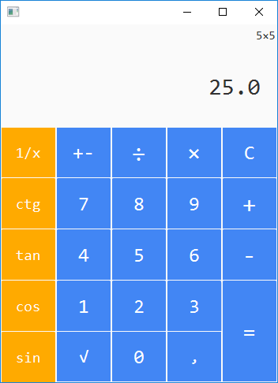

# Calculator
These is my calculator.

Design was created in SceneBuilder.

        If you want you can change these program and design
        What i want to add:
        Ability to input by keybord
        operators '(',')'
        acos,asin,atan,actg
        Procents(%)
        Backspace
        Degreeses
        x^3 and x^2
